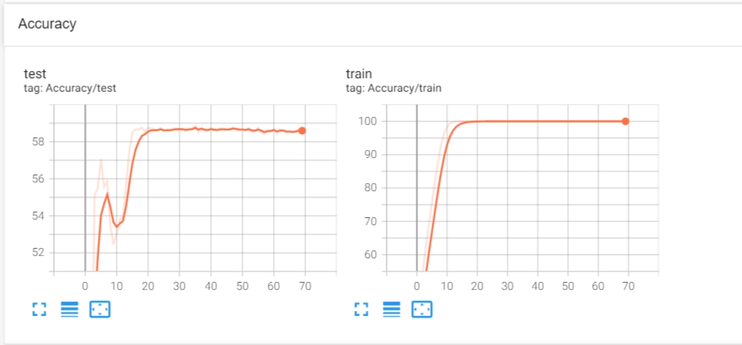

### 1. 列出各层名称及大小

使用如下代码即可输出模型结构以及中间层大小。
```python
model = models.__dict__['resnet18']()
input_num = model.fc.in_features
model.fc = nn.Linear(input_num,200)
summary(model, (3, 64, 64))
```

得到结果如下:

@import "model struct.txt"

## 2. 代码改动说明

使用如下git命令生成了主干和分支的代码对比

```git
git diff main my_imagenet < diff.patch
```

得到的结果保存在```diff.patch```中

@import "test.patch"

## 3. 代码运行曲线

代码参数为: ```batch_size=256,epoch=70```，并且将源代码中对图像的预处理部分进行了删除

#### Loss曲线


#### Accuracy (Top 5)



从上面的曲线中可以看出，模型在大约20个epoch处就已经拟合到了最优值，在训练集上的```Loss```已经收敛到了0, ```Top5 Accuracy``` 也几乎达到了```100%```. 

但是从测试集上的情况上看,模型存在一定的过拟合现象.在30个epoch之后,模型在测试集上的```Loss```已经收敛,保持在5的位置上.同时,```Top5 Accuracy```在```60%```左右,还是一个不算太高的水平.


## 4. 比较checkpoint

这里我采用了模型运行过程中记录的两个checkpoint进行比较: ```checkpoint_best```, ```checkpoint_10epoch```, 分别对应拟合最好的模型和在10epoch处的模型.

为了方便地了解每张图上的模型预测结果,我在使用```-evaluate```模式的同时,对代码也进行了一定的修改,改动位置如下.

##### 1. 调整batch_size = 1
##### 2. 修改validate函数 
在函数中添加将预测结果以及真实标签写入文件的相关代码
```python
f.write("{},{},{}\n".format(i,int(target),int(output.argmax())))
```

最终得到的结果如下:

##### 1. 模型预测结果差异

这里仅对前15张图片的预测结果进行列举(剩余内容可以在```output_bestcheckpoint.txt```和```output_checkpoint_epoch10.txt```中查看)

```txt
# 图片序号,正确标签,best-预测结果,epoch10-预测结果
0,0,148,0
1,0,0,163
2,0,0,0
3,0,0,0
4,0,0,0
5,0,0,45
6,0,0,0
7,0,0,0
8,0,0,186
9,0,0,3
10,0,0,185
11,0,13,45
12,0,0,0
13,0,185,44
14,0,38,36
15,0,0,0
```

从这些图片可以看出,```best model```与10个epoch训练出的模型在准确率上是有一定的提升的.

同时,我这里还列出十张评判结果不同的图片.可以看出,基本都是10个epoch训练出的模型预测出现了错误.

```txt
# 图片序号,正确标签,best-预测结果,epoch10-预测结果
0,0,148,0
1,0,0,163
5,0,0,45
8,0,0,186
10,0,0,185
11,0,13,45
13,0,185,44
14,0,38,36
39,0,45,17
45,0,0,54
```

#### 2. 模型准确率差异

这里对两种模型的评估结果进行了展示:

**checkpoint_epoch10**


**checkpoint_best**


可以看到，最好的模型在两种准确率上都要比10个epoch训练出的模型更高。